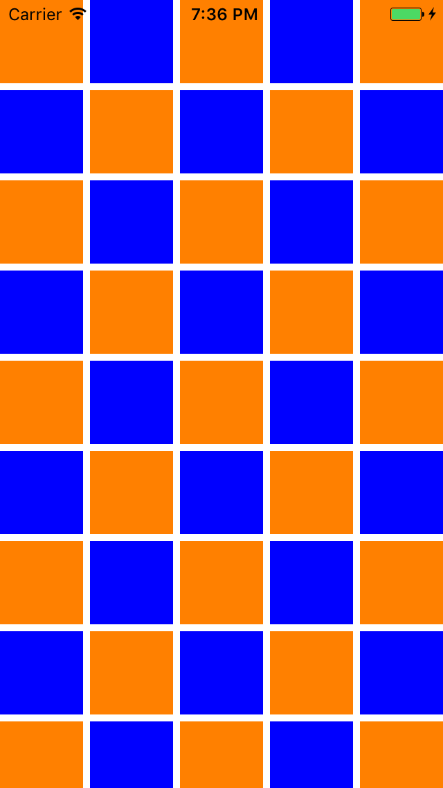
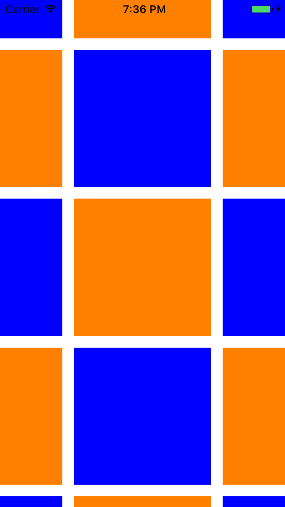

# ZoomCollectionView for iOS
`UICollectionView` is great, but it is not zoomable (which is rather strange since
it is inherits from `UIScrollView`). This project is an attempt to implement zooming
using custom a `UICollectionViewLayout` which resizes itself to simulate the effect
we know and love from `UIScrollView`.

## Result

&nbsp;
&nbsp;
&nbsp;
&nbsp;


## How does it work?
`ZoomCollectionView` is a container view that encapsulates three views:
- A `UICollectionView` for the actual collection data
- A `UIScrollView` for the zoom/scroll hooks
- A dummy `UIView` that the scroll view uses for its zooming capabilities

When the scroll view is zoomed or scrolled it forwards the content offset to
the collection view and the scale factor to the `UICollectionViewLayout` which
implements the following protocol:

```swift
public protocol ScalingLayoutProtocol {
    func getScale() -> CGFloat
    func setScale(_ scale: CGFloat) -> Void
    func contentSizeForScale(_ scale: CGFloat) -> CGSize
}
```

How the layout recalculates its attributes is implementation specific but an example
can be found in `ScalingGridLayout`.

## What works
- Scrolling
- Zooming

## What does not work
- The bounce effect when `minimumZoomScale` or `maximumZoomScale` is reached. The reason for this is that the bounce effect does not trigger `scrollViewDidZoom` in the scroll view.
